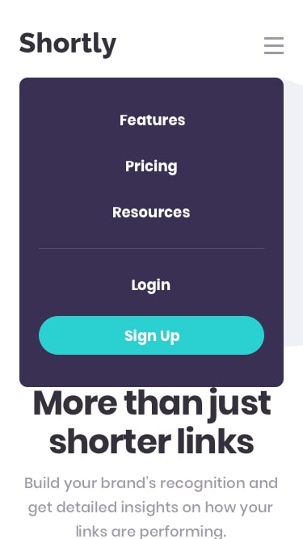

<div align="center">
  
  
  
  
  [](https://twitter.com/intent/follow?screen_name=RSanchez_Eze)
  
  <br/>
  

  <h2 align="center">Shortly Landing Page</h2>
  Shortly is a full responsive landing page.
  <br/>Responsive for all devices, desktop first design. Build using HTML, CSS & JavaScript.
  <br/>
  <a href="https://eruedasanchez.github.io/shortly-landing-page/" target="_blank"><strong>➥ Live Demo</strong></a>

</div>

<br />

### Demo Screenshots




### Technologies

* [HTML](): Version 5 
* [CSS](): Version 3
* [JavaScript](): Version ES6
* [GIT](): Version 2.40

### Prerequisites

Before you begin, ensure you have met the following requirements:

* [Git](https://git-scm.com/downloads "Download Git") must be installed on your operating system.

### Run Locally

To run **Time Tracking Dashboard** locally, run this command on your git bash:

Linux and macOS:

```bash
sudo git clone https://github.com/eruedasanchez/shortly-landing-page
```

Windows:

```bash
git clone https://github.com/eruedasanchez/shortly-landing-page
```

### Contact

If you want to contact with me you can reach me at [LinkedIn](https://www.linkedin.com/in/e-ruedasanchez/).

### License

This project is **free to use** and does not contains any license.
